## HW 4

### 1. Create DB, tables
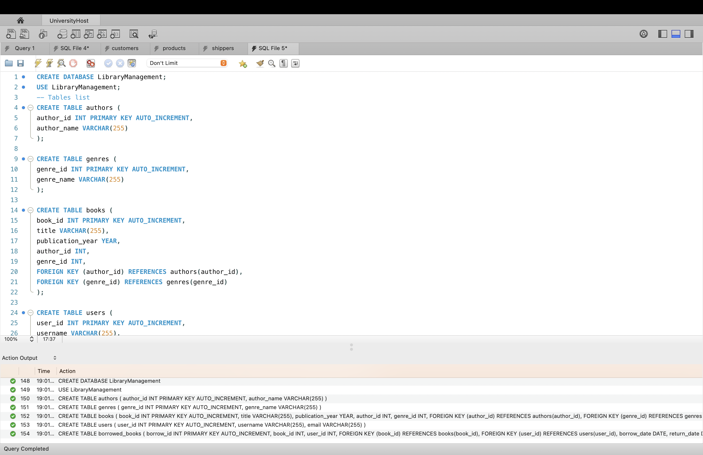
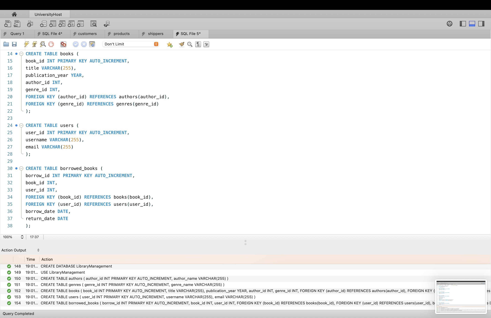

**Logs on screnshoots confirm the db and tables were successfully created.**

### 2. Insert fake values

- SQL
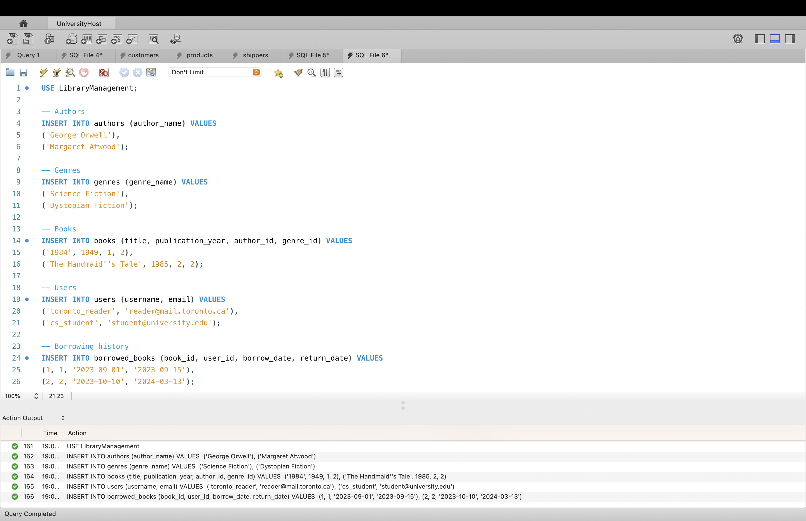

- Outut example (books)
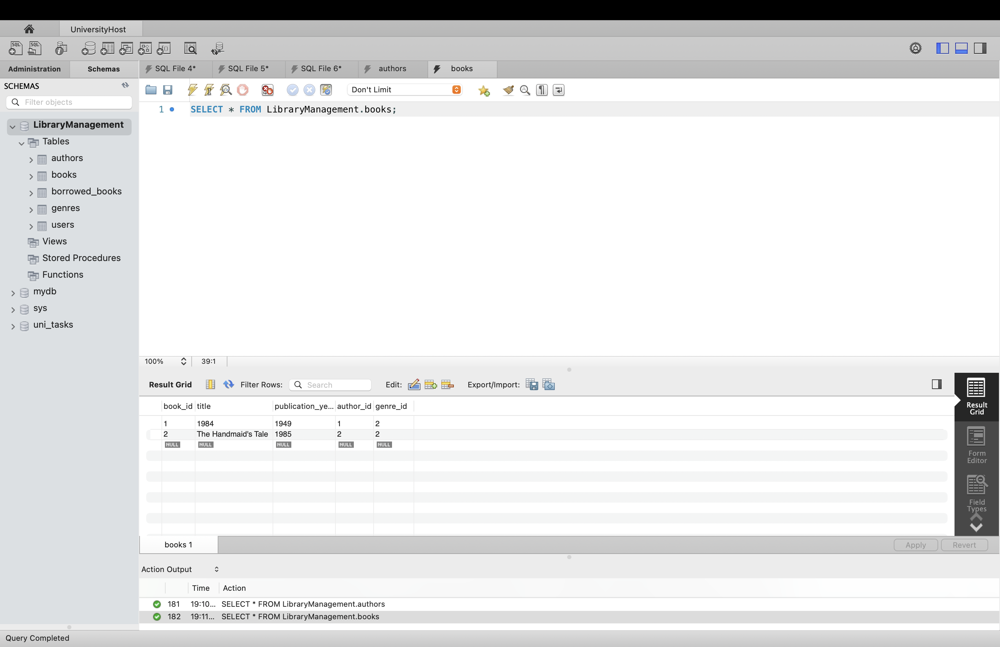

### 3. INNER JOIN all tables
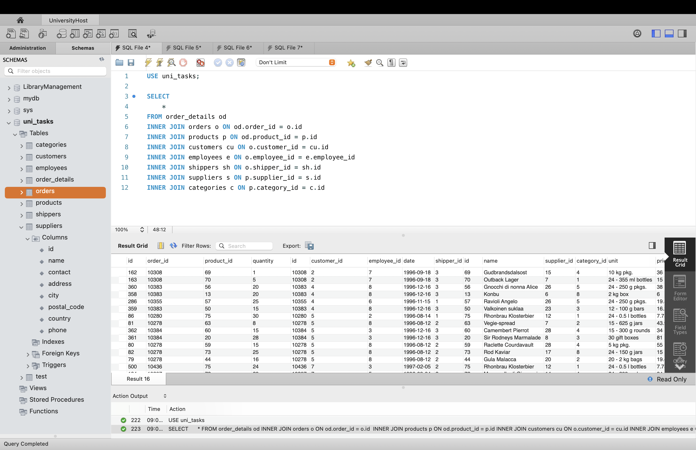

### 4. 
* 4.1
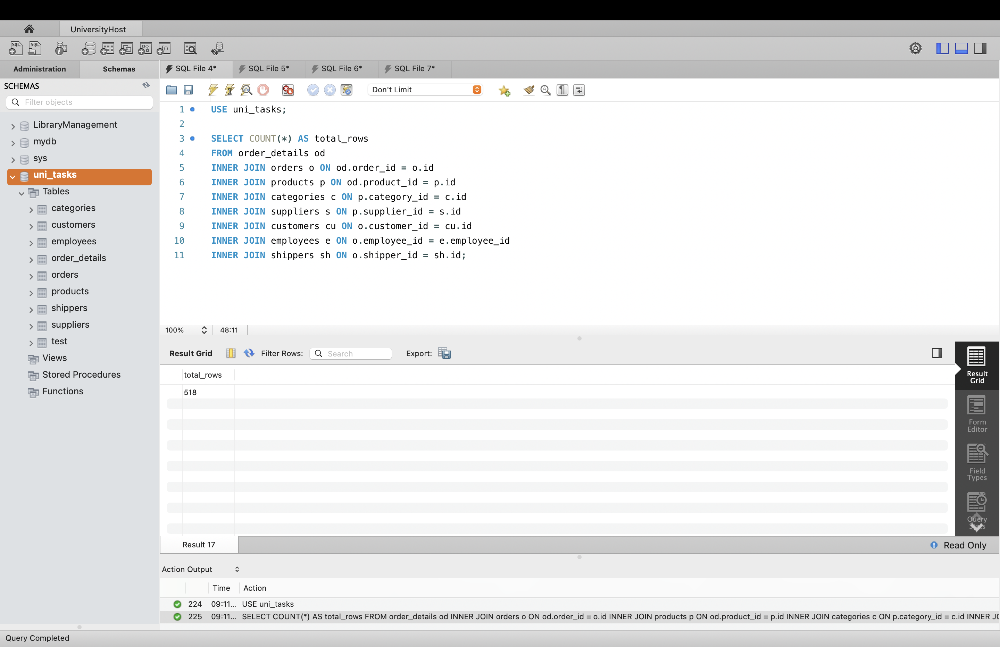

* 4.2 При заміні INNER JOIN на LEFT JOIN кількість рядків у вибірці може збільшитися, але не в данному випадку. INNER JOIN діє як перетин множин і відкидає записи, якщо для них немає відповідності між таблицями. А LEFT JOIN зберігає всі без винятку записи з лівої таблиці. Якщо в базі існують неповні дані, LEFT JOIN залишить цей рядок у результаті, заповнивши відсутні поля значеннями NULL.
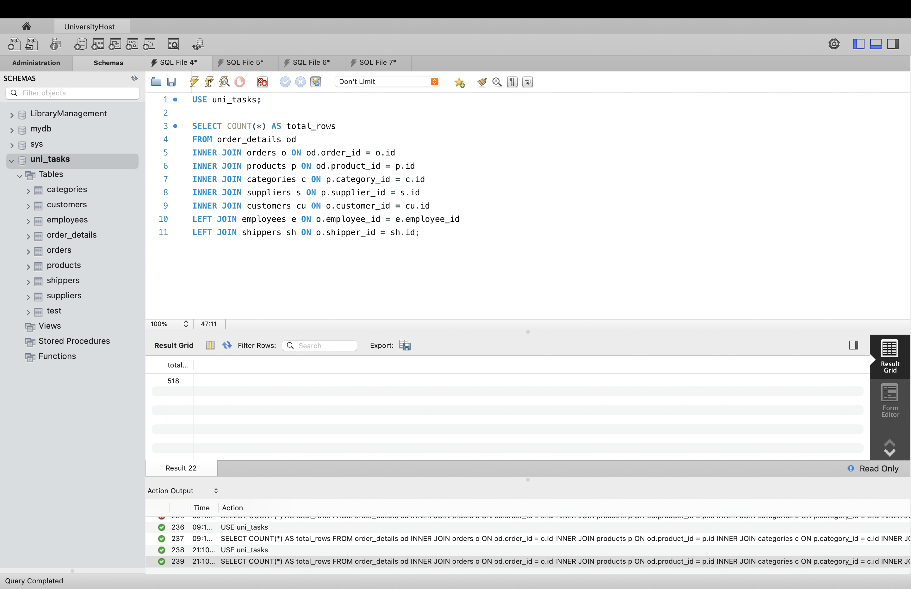

* 4.3
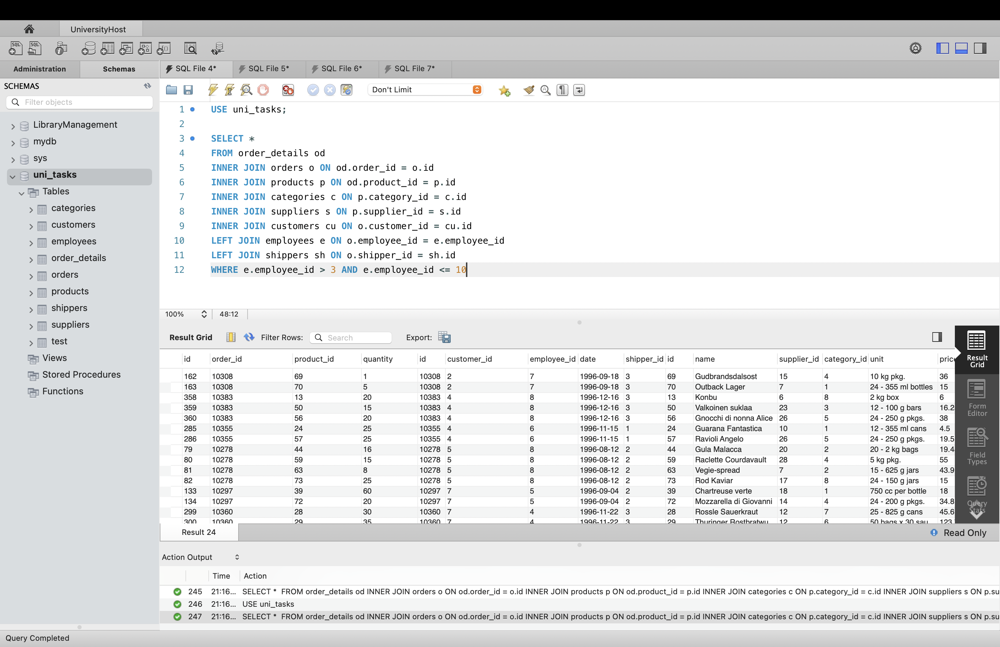

* 4.4
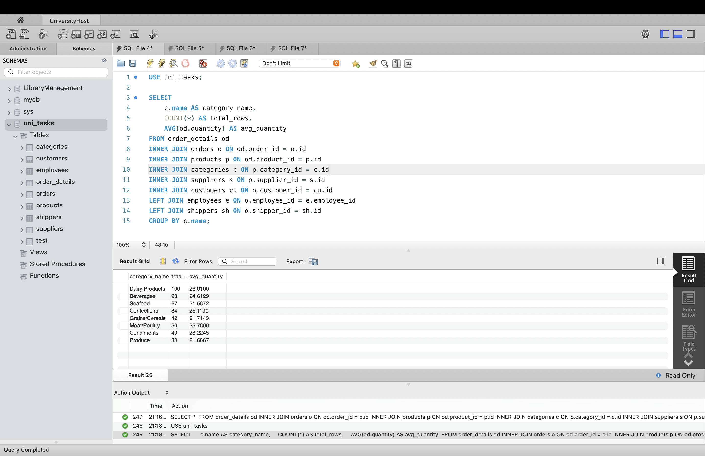

* 4.5
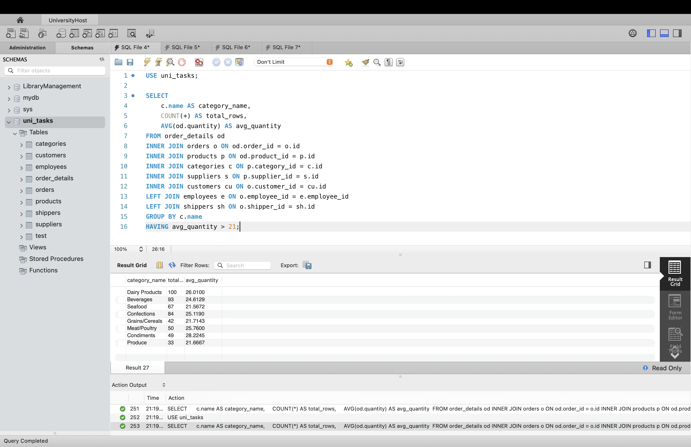

* 4.6
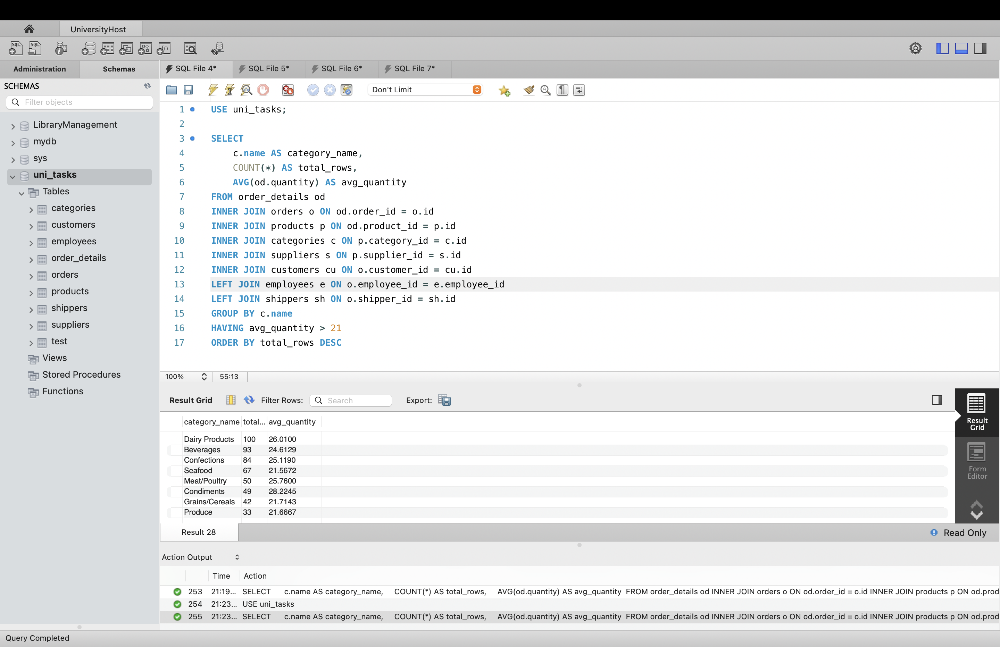

* 4.7
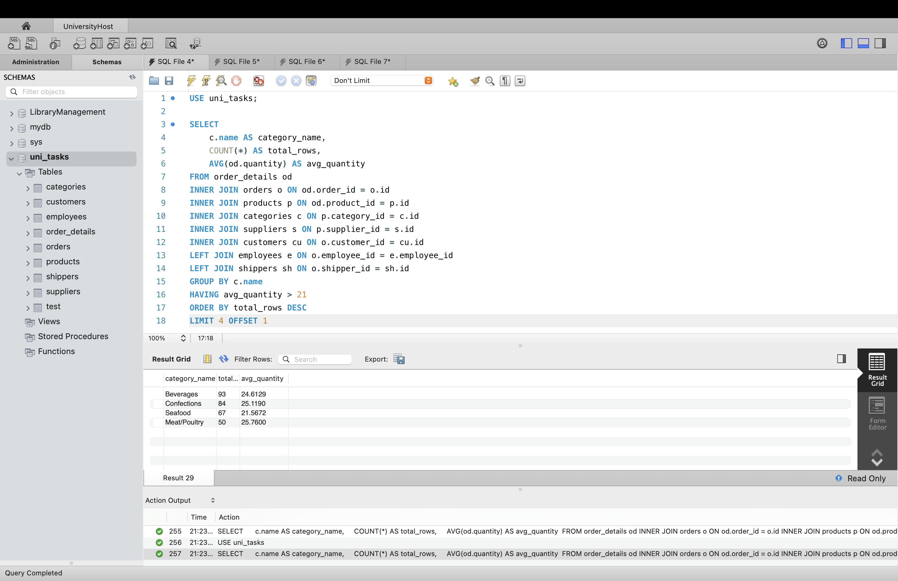 
